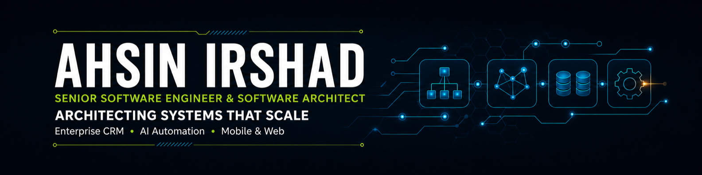

  

  I build production software across APIs, business platforms, mobile applications, 
  automation workflows, databases, and self-hosted infrastructure.

  
  
  

  <a href="#automation">Automation</a> •
  <a href="#web-development">Web Development</a> •
  <a href="#mobile-apps">Mobile Apps</a> •
  <a href="#technologies">Technologies</a> •
  <a href="#connect">Connect</a>

---

### What I Build

- **Business platforms and SaaS** — APIs, operational workflows, dashboards, subscriptions, and multi-client systems
- **AI and workflow automation** — n8n pipelines, content operations, integrations, backups, and deployment automation
- **Web and mobile products** — Vue, FastAPI, Laravel, and Flutter applications backed by production infrastructure
- **End-to-end delivery** — Docker, CI/CD, private registries, reverse proxies, and self-hosted services

## ⚙️ Recent Automation Projects

<table>
<tr>
<td width="50%" valign="top">
  <h3>Article Generation & Publishing</h3>
  
AI-assisted workflow that turns approved topics into structured articles, applies formatting and content checks, and publishes them to configured channels with minimal manual handling.

  
<code>AI Content</code> <code>n8n</code> <code>Publishing APIs</code>

</td>
<td width="50%" valign="top">
  <h3>MySQL Backups to MinIO</h3>
  
Fully self-hosted backup pipeline that schedules MySQL dumps and stores them in MinIO or other S3-compatible storage, keeping infrastructure and data under the operator's control.

  
<code>Python</code> <code>FastAPI</code> <code>MySQL</code> <code>MinIO</code>

</td>
</tr>
<tr>
<td width="50%" valign="top">
  <h3>Git-Push Deployment Automation</h3>
  
CI/CD workflow triggered by Git pushes to build versioned containers, publish application images, and deploy projects consistently across environments.

  
<code>Git</code> <code>Docker</code> <code>CI/CD</code> <code>Harbor</code> <code>Coolify</code>

</td>
<td width="50%" valign="top">
  <h3>YumMeal Recipe Extraction</h3>
  
n8n workflow that extracts recipes from source pages, normalizes ingredients and instructions, and prepares structured content for the YumMeal platform.

  
<code>n8n</code> <code>Data Extraction</code> <code>Content Automation</code>

</td>
</tr>
</table>

## 🌐 Recent Web-Based Developments

<table>
<tr>
<td width="50%" valign="top">
  <h3><a href="https://www.heico-group.com/en/">HEICO CRM</a></h3>
  
<strong>Enterprise CRM & Workflow Platform</strong>

  
Internal CRM and recurring-work platform supporting customer information, task coordination, repeatable workflows, and day-to-day operational visibility.

</td>
<td width="50%" valign="top">
  <h3><a href="https://thecinewizard.com/">TheCineWizard</a></h3>
  
<strong>Entertainment Content Platform</strong>

  
Responsive platform for movie and television reviews, industry news, curated recommendations, and discovery-focused editorial content.

</td>
</tr>
<tr>
<td width="50%" valign="top">
  <h3><a href="https://cineflicksnews.com/">Cineflicks News</a></h3>
  
<strong>Entertainment News Platform</strong>

  
Content-focused website for publishing and browsing movie and television stories, reviews, announcements, and industry updates.

</td>
<td width="50%" valign="top">
  <h3><a href="https://support.amigoallmotorsireland.com/">Amigo Support</a></h3>
  
<strong>Customer Support Portal</strong>

  
Responsive support experience for a vehicle-service platform, combining structured inquiry workflows with manageable help content.

</td>
</tr>
<tr>
<td width="50%" valign="top">
  <h3><a href="https://nailsalon.club/">NailSalon.club</a></h3>
  
<strong>Membership & Booking SaaS</strong>

  
Members-only salon platform combining appointment booking, Stripe subscriptions, membership management, and service-quota enforcement.

</td>
<td width="50%" valign="top">
  <h3><a href="https://modernnailbarkeller.com/">Modern Nail Bar Keller</a></h3>
  
<strong>Salon Website & Booking Experience</strong>

  
Responsive salon website presenting services, pricing, galleries, customer reviews, and a streamlined path to online booking.

</td>
</tr>
<tr>
<td width="50%" valign="top">
  <h3><a href="https://eyelashjacksonville.com/">Eyelash Jacksonville</a></h3>
  
<strong>Local Service Website</strong>

  
Mobile-first salon website with structured services, customer-friendly navigation, appointment inquiries, and a polished local-business presence.

</td>
<td width="50%" valign="top">
  <h3>From Requirement to Production</h3>
  
<strong>Full-Stack Delivery</strong>

  
Architecture, APIs, interfaces, databases, integrations, deployment, and production verification delivered as one connected system.

</td>
</tr>
</table>

## 📱 Recent Mobile Application Projects

<table>
<tr>
<td width="33%" align="center" valign="top">
   
  <h3>Mubasher.Info</h3>
  
Social trading and market intelligence with stock insights, analysis, alerts, and investor communities.

  
<a href="https://apps.apple.com/bh/app/mubasher-info/id6472443851">App Store</a> · <a href="https://play.google.com/store/apps/details?id=com.gfm.tadawuly&amp;hl=en">Google Play</a>

</td>
<td width="33%" align="center" valign="top">
   
  <h3>SafeMom</h3>
  
AI-powered ingredient analysis for evaluating cosmetics, food, and medicine during pregnancy.

  
<a href="https://apps.apple.com/us/app/safemom-ingredient-checker/id6746147849">App Store</a> · <a href="https://play.google.com/store/apps/details?id=net.magnificentservices.safe_mom">Google Play</a>

</td>
<td width="33%" align="center" valign="top">
   
  <h3>AMIGO</h3>
  
Vehicle-care and service-booking application covering roadside assistance, maintenance, and inspections.

  
<a href="https://play.google.com/store/apps/details?id=net.magnificentservies.amigo">Google Play</a>

</td>
</tr>
<tr>
<td width="33%" align="center" valign="top">
   
  <h3>Thermowrap</h3>
  
Field-workforce application supporting GPS tracking, job coordination, and operational visibility.

  
<a href="https://thermowrap.com.au/">Project Website</a>

</td>
<td width="33%" align="center" valign="top">
   
  <h3>PayBora</h3>
  
Fintech application supporting digital payments, wallet functionality, and customer transactions.

  
<a href="https://play.google.com/store/apps/details?id=com.paybora.customer">Google Play</a>

</td>
<td width="33%" align="center" valign="middle">
  <strong>27+ applications delivered</strong>  
  Experience spanning fintech, healthcare, logistics, media, education, food delivery, and consumer utilities.  
  <a href="https://ahsinirshad.com/#portfolio">View Full Portfolio →</a>
</td>
</tr>
</table>

## 🧰 Technologies & Delivery Stack

  

  <code>n8n</code> · <code>Coolify</code> · <code>Traefik</code> · <code>Harbor</code> · <code>Proxmox VE</code> · <code>SQLModel</code> · <code>Airtable</code> · <code>MinIO</code>

### Delivery Approach

- Translate business requirements into clear technical architecture
- Build secure APIs, responsive interfaces, and practical automation
- Connect web, mobile, database, and infrastructure work as one system
- Automate repetitive engineering and operational processes
- Own deployment, verification, and production reliability

---

<h2 align="center">Let's Build Something Useful</h2>

  If you are building a business platform, mobile application, or automation-heavy workflow, 
  send me the requirements, target platforms, existing stack, and required integrations.

  <a href="https://ahsinirshad.com/"><strong>Portfolio</strong></a> ·
  <a href="https://www.linkedin.com/in/ahsin-irshad/"><strong>LinkedIn</strong></a> ·
  <a href="mailto:ahsinirshad22@gmail.com"><strong>Email</strong></a>

Designed around production work, measurable outcomes, and end-to-end delivery.

